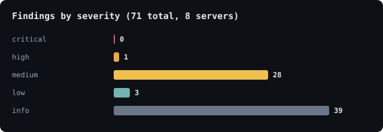

<div align="center">

# 🛰️ State of MCP Security

**A reproducible security audit of Model Context Protocol servers.**

We scanned the official MCP reference servers plus eight popular hosted servers (12 total).
**83% exposed at least one medium-or-higher hardening issue** to connecting AI agents.

[**📄 Read the full report →**](REPORT.md) · powered by [mcpscan](https://github.com/nadirzhon/mcpscan)



</div>

---

## Round 1 at a glance

| | |
|---|---|
| Servers scanned | **12** (official reference + 8 popular hosted) |
| Total findings | **91** |
| Servers with a medium+ issue | **10 / 12 (83%)** |
| Top patterns | unconstrained inputs · missing schema locks · unguarded dangerous capabilities |

Full analysis, per-server breakdown, methodology, and ethics: **[REPORT.md](REPORT.md)**.
Data: [`data/results.json`](data/results.json) (official) · [`data/hosted-aggregate.json`](data/hosted-aggregate.json) (hosted, anonymized) · [`data/summary.json`](data/summary.json).

## Reproduce it

```bash
# scan any MCP server yourself
uvx --from git+https://github.com/nadirzhon/mcpscan mcpscan "<server url or command>" --json

# re-run the whole corpus
pip install "git+https://github.com/nadirzhon/mcpscan"
MCPSCAN=mcpscan python scripts/scan.py
python scripts/charts.py
```

Everything is read-only — mcpscan inspects tool *definitions* and never invokes a tool.

## Contribute to Round 2

Add a server to [`scripts/corpus.json`](scripts/corpus.json) and open a PR (hosted HTTP servers
preferred — safe to scan without running untrusted code). Round 2 aims for a larger corpus and
trend lines over time.

## Ethics

Only public servers, scanned read-only, tools never invoked. Official reference servers are named
(public reference code); hosted third-party services are aggregated/anonymized, with any genuine
high-severity finding verified and disclosed privately to the vendor first — never published as a
name-and-shame. Detect, not exploit. See [REPORT.md § Ethics](REPORT.md#ethics--responsible-disclosure).

## License

Code & data: MIT (see [LICENSE](LICENSE)). Findings are heuristic and may be imperfect.
