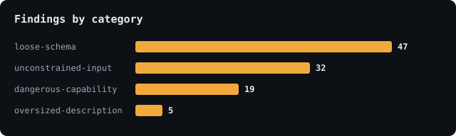

# State of MCP Security — Round 2

*A reproducible security audit of Model Context Protocol servers. Round 2 covers the
official MCP reference servers plus eight popular hosted servers (N = 12).*

> **TL;DR** — We scanned **12 MCP servers** with [mcpscan](https://github.com/nadirzhon/mcpscan).
> **10 of 12 (83%)** exposed at least one medium-or-higher hardening issue to connecting AI agents.
> The dominant patterns are **unconstrained free-text inputs** (path/command/url params with no
> validation) and **dangerous capabilities exposed without guardrails**. Findings are heuristic
> hardening observations, not confirmed exploits.

---

## Why this matters

An MCP server hands tools straight into an AI agent's context, and the agent will act on
whatever those tools describe and accept. That makes a server's *tool surface* a security
boundary — and today almost nobody measures it. This is an ongoing, reproducible attempt to.

## Headline numbers




| Metric | Value |
|---|---|
| Servers scanned | **12 / 12** (0 failed) |
| Total findings | **91** |
| Servers with a medium-or-higher finding | **10 (83%)** |
| Severity spread | 2 high · 40 medium · 3 low · 46 info |
| Most common issue | `loose-schema` (46) → `unconstrained-input` (25) → `dangerous-capability` (17) |

## What we found (the systemic patterns)

1. **Unconstrained inputs are everywhere (25 findings).** Free-text `path`, `command`, `url`,
   and `query` parameters with no `enum`/`pattern`/`format` are the norm, not the exception. On a
   filesystem server, *every* path parameter is a traversal surface an injected instruction can aim at.
2. **Schemas rarely lock down inputs (46 findings, `info`).** Most tools omit
   `additionalProperties: false`, so unexpected fields pass through. Low-severity hygiene, but
   pervasive — even in the reference implementations.
3. **Dangerous capabilities ship without guardrails (17 findings).** File write/delete, network
   egress, and command-execution-shaped tools are commonly exposed with no authorization or
   confirmation signal in the definition. In an agent, a prompt-injected instruction can reach them.
4. **Two hosted servers tripped high-severity multi-capability heuristics** (a filesystem-style
   tool and a docs-search tool matching multiple dangerous-capability patterns at once). Both look
   like **false positives on broad tools**, not confirmed vulnerabilities — exactly the case the
   scanner is designed to *surface for review*, not to headline. They are set aside for manual
   verification and, if anything holds up, private vendor notification (see Ethics).

## The corpus

**Official reference servers** (public code from `@modelcontextprotocol`, scanned via `npx`):

| Server | Findings | Notable |
|---|---|---|
| `server-filesystem` | 25 | 12× unconstrained `path`, 1× file-write-delete capability |
| `server-memory` | 12 | 4× unconstrained inputs |
| `server-everything` | 11 | 2× dangerous-capability |
| `server-sequential-thinking` | 2 | clean apart from schema hygiene |

The official Python servers (`fetch`, `git`, `time`) were **excluded** due to a local Python 3.14
packaging incompatibility, not scanned — not a finding.

**Popular hosted servers** (HTTP, connected read-only; **presented in aggregate only** per the
ethics policy below): eight widely-used hosted MCP servers — spanning major cloud, developer-docs,
search, and AI vendors — contributed **41 findings**, ranging from clean (schema hygiene only) to
the two high-severity heuristic flags noted above. Per-server detail is withheld; anonymized
counts are in [`data/hosted-aggregate.json`](data/hosted-aggregate.json).

## Methodology

- **Tool:** [mcpscan](https://github.com/nadirzhon/mcpscan) — connects to a server, enumerates its
  tools/resources/prompts, and runs deterministic checks (hidden text, tool-poisoning phrasing,
  dangerous capabilities, unconstrained inputs, loose schemas).
- **Read-only.** No tool is ever invoked. mcpscan inspects *definitions*, it does not exercise them.
- **Reproducible.** Rerun with [`scripts/scan.py`](scripts/scan.py). Official-server detail in
  [`data/results.json`](data/results.json); anonymized hosted aggregates in
  [`data/hosted-aggregate.json`](data/hosted-aggregate.json); aggregate stats in
  [`data/summary.json`](data/summary.json).
- **Heuristic, by design.** Findings are pattern-based hardening observations, not verified
  vulnerabilities. The two highs above are illustrative false positives.

## Ethics & responsible disclosure

- **Only public servers**, scanned **read-only**, tools never invoked.
- **Official reference servers are named** — public reference code; these are design-hardening
  observations on published examples, not vulnerability disclosures.
- **Hosted third-party services are aggregated and anonymized.** No specific finding is published
  against a named vendor. The high-severity heuristic flags are verified manually and, if anything
  holds up, reported privately to the vendor first — never published as name-and-shame.
- **Detect, not exploit.** Nothing here is a working exploit or an invitation to attack anyone.

## Round-over-round

| | Round 1 | Round 2 |
|---|---|---|
| Servers | 8 | **12** |
| Findings | 71 | **91** |
| % with medium+ | 75% | **83%** |
| High-severity flags | 1 | **2** |

## Limitations

- **Still a baseline, not a census.** The value is that it is *reproducible and extensible*.
- **Heuristic checks** over-report hygiene (`loose-schema`) and can false-positive on broad tools
  (both highs are such cases pending review).
- **stdio servers require executing their code**, so stdio scans are limited to trusted official
  servers; third-party servers are scanned over HTTP only.

## Help expand Round 3

Run any MCP server and open a PR with the result, or just share the endpoint:

```bash
uvx --from git+https://github.com/nadirzhon/mcpscan mcpscan "<your MCP server>" --json
```

Round 3 targets a larger corpus of **hosted** servers (safe to scan without running untrusted
code) and per-category trend lines over time.

---

*Produced with [mcpscan](https://github.com/nadirzhon/mcpscan). Findings are AI-assisted /
heuristic and may be imperfect — treat them as a first pass, not a verdict.*
